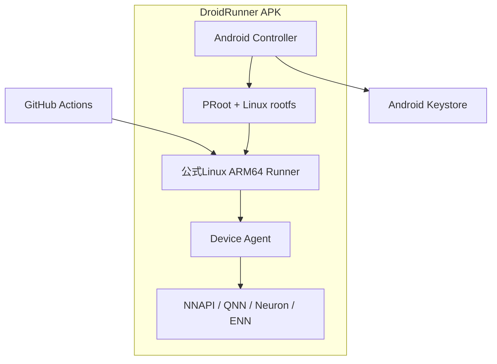

# DroidRunner

**眠っているAndroid端末を、GitHub Actionsの実機Runnerへ。**

[English README is here](README.md)

DroidRunnerは、ARM64 Android端末をRepository単位のGitHub Actions
self-hosted runnerとして動作させるAndroidアプリです。

Termuxやroot権限、PCへのUSB常時接続は必要ありません。APKがLinux実行環境と
公式GitHub Actions Runnerの導入・登録・常駐を管理します。通常のARM64ビルドに加え、
Android端末固有のNNAPIやベンダーNPUをCIから検証できる端末プールを目指しています。

> [!WARNING]
> 現在は初期PoCです。Runner管理の基礎実装はありますが、配布可能なruntime bundleと
> NPU Device Agentは開発中です。本番環境や信頼できないRepositoryでは使用しないでください。

## 目標

- 余っているスマートフォンやタブレットをARM64ビルド資源として再利用する
- Qualcomm、Google Tensor、MediaTek、Exynosなどの実機差をGitHub Actionsから検証する
- 複数端末をラベルで分類し、必要なSoCやNPUへジョブをルーティングする
- Androidアプリだけで導入・更新・監視を完結させる
- バッテリー、充電状態、発熱を考慮して安全にジョブを受け付ける

## 特徴

- **APK単体** — Termuxなどのコンパニオンアプリは不要
- **root不要** — PRoot上でLinux ARM64環境を実行
- **公式Runner** — GitHub公式のLinux ARM64 Actions Runnerを使用
- **Repository限定** — 初期バージョンでは1つのRepositoryだけへ登録
- **GitHub Appログイン** — Device Flowでサインインしてリポジトリを選ぶだけ。PATの手動発行は不要
- **端末自動分類** — Android API、SoC、NPU候補からRunnerラベルを生成
- **安全な資格情報管理** — PATをAndroid Keystoreで暗号化
- **バックグラウンド待機** — Foreground ServiceとWakeLockでRunnerを維持
- **改ざん検出** — runtime bundleを展開する前にSHA-256を検証
- **btop風ダッシュボード** — CPU・メモリ・バッテリー・温度・ディスク・ネットワークの
  リソースモニターとRunner稼働状況をリアルタイム表示

## 全体構成



通常のシェル、Git、Node.js、Python、Rust、Go、GradleなどはPRoot側で実行します。
Android APIやNPUへアクセスするテストは、loopback APIを介してAPK内のDevice Agentへ依頼します。

## ダッシュボード

アプリのメイン画面は、btopに着想を得たターミナル風ダッシュボードです
(Jetpack Composeで描画)。


- **cpu** — 負荷履歴グラフと、コアごとのメーター+現在周波数
  (コア負荷は読み取り可能なら`/proc/stat`の差分、不可なら最大周波数に対する
  現在のscaling周波数を使用)
- **mem / disk** — RAMとアプリ専用ストレージの使用率メーターと履歴
- **pwr/net** — バッテリー残量と充電状態、バッテリー温度、Androidサーマルステータス、
  ネットワークスループット
- **runner** — Runnerの状態(停止 / 起動中 / ジョブ待機 / ジョブ実行中)、登録先
  Repository、稼働時間、成功・失敗ジョブ数、Runnerログのライブテール
- **setup** — 登録フォームと開始/停止ボタンをまとめた折りたたみパネル

Runnerの状態は、Foreground Serviceが公式Runnerのlistener出力をパースし、
`StateFlow`としてUIへストリームします。

## 現在の実装状況

| 機能 | 状態 |
| --- | --- |
| btop風ダッシュボードUI | PoC実装済み |
| GitHub App Device Flowログイン+リポジトリ選択 | PoC実装済み |
| Repository登録トークンの取得 | PoC実装済み |
| 資格情報のKeystore保存(userトークン / PAT) | PoC実装済み |
| runtime bundleの取得・SHA-256検証 | PoC実装済み |
| prootのNDKビルド(APK同梱)+ bundle CI | PoC実装済み |
| PRootでの公式Runner起動 | 実機検証済み(ジョブ実行成功) |
| Foreground Service(Runner状態パース付き) | PoC実装済み |
| SoC/NPU候補ラベル | PoC実装済み |
| 充電・温度・ストレージ制御 | 設計済み・未実装 |
| NPU Device Agent | 設計済み・未実装 |
| 複数端末ダッシュボード | 未実装 |
| 署名付きruntime manifest | 未実装 |

## Runnerラベル

公式Runnerが追加する標準ラベルに加え、DroidRunnerは次のカスタムラベルを使用します。

| ラベル | 意味 |
| --- | --- |
| `android` | DroidRunner上で動作するAndroid実機 |
| `arm64` | ARM64端末 |
| `android-api-N` | Android API Level |
| `soc-*` | 検出したSoC情報 |
| `android-npu` | NPU搭載候補端末 |
| `android-no-npu` | NPUを検出できなかった端末 |
| `npu-qnn` | Qualcomm QNN候補 |
| `npu-tflite` | Google Tensor / LiteRT候補 |
| `npu-neuron` | MediaTek Neuron候補 |
| `npu-enn` | Samsung ENN候補 |

SoC名による判定はあくまで候補です。完成版ではDevice Agentが実際にバックエンドをprobeし、
利用可能性を確認できたラベルだけを公開します。

## Workflow例

### 任意のAndroid端末で実行

```yaml
name: Android device test

on:
  workflow_dispatch:

permissions:
  contents: read

jobs:
  test:
    runs-on: [self-hosted, android, arm64]
    steps:
      - uses: actions/checkout@v4
      - run: uname -a
      - run: ./ci/test-arm64.sh
```

### Qualcomm NPU端末を指定

```yaml
jobs:
  qnn-test:
    runs-on: [self-hosted, android, android-npu, npu-qnn]
    steps:
      - uses: actions/checkout@v4
      - run: droidrunner-device test qnn ./models/model.onnx
```

`droidrunner-device` CLIとDevice Agent APIは未実装です。上の例は予定しているインターフェースです。

## 必要環境

### Android端末

- ARM64(`arm64-v8a`)
- Android 9 / API 28以上
- 数GB程度の空き容量
- 安定したネットワーク接続
- 長時間運用では充電器と冷却手段を推奨

32bit ARM、x86 Android、Docker、KVM、nested virtualizationには対応しません。

### ビルド環境

- JDK 17
- Android SDK 35
- Android Studio Ladybug以降、またはGradle 8.10系

## ビルド

```bash
git clone <repository-url>
cd DroidRunner
ANDROID_NDK_ROOT=$ANDROID_HOME/ndk/<version> runtime/build-proot.sh
gradle assembleDebug
```

`build-proot.sh`はNDKでprootをクロスビルドして`app/src/main/jniLibs/`へ配置します
(初回に1度必要。Android 10以降はAPK同梱バイナリしかexecできないため)。

生成されるAPK:

```text
app/build/outputs/apk/debug/app-debug.apk
```

このRepositoryにはGitHub Actions用のビルド定義も含まれています。

## セットアップ

1. GitHub Actionsの**Runtime bundle**ワークフローを`release_tag`付きで実行する
   (またはARM64ホストで`runtime/build-bundle.sh`を実行)— `runtime/README.md`参照
2. Releaseに公開された`runtime-manifest.json`のURLを控える
3. DroidRunner APKを端末へインストールする
4. setupパネルの**Connect GitHub**を押す — 8桁のコードが表示される(クリップボードへ
   自動コピー)。`github.com/login/device`でコードを入力して承認する
5. DroidRunner GitHub Appがどのリポジトリにも未インストールの場合、アプリが
   インストールを促すので、Runnerを割り当てたいリポジトリへインストールする
6. リストからリポジトリを選択する
7. Runtime manifest URLを入力して**Install runtime**を押す
8. **Register \<owner\>/\<repo\>**を押す
9. **Start**を押してRunnerを待機状態にする

サインインはGitHub AppのDevice Flowを使うため、APKにclient secretは含まれず、
PATを手動で発行する必要もありません。userトークンはAndroid Keystoreで暗号化され、
Linux環境へは渡りません。Controllerが短時間有効な登録トークンへ交換します。

手動フォールバック(`advanced: manual PAT setup`)では、対象Repositoryの
Administration read/write権限を持つfine-grained PATを使えます(GitHub Enterprise
ServerやGitHub Appなしビルド向け)。

### GitHub Appの登録(セルフビルド向け)

Device FlowにはGitHub Appの登録が必要です(無料・サーバー不要・1回だけ):

1. GitHub → Settings → Developer settings → **New GitHub App**
2. Repository permissionで**Administration: Read and write**を付与。webhookは不要
3. **Device flow**を有効化
4. 推奨: user access tokenの有効期限をオプトアウト(Optional features)しておくと
   リフレッシュ処理が不要になる
5. 公開識別子を`gradle.properties`へ設定する:

```properties
droidrunner.githubAppClientId=Iv1.xxxxxxxxxxxxxxxx
droidrunner.githubAppSlug=your-app-slug
```

未設定の場合、アプリはGitHubログインを表示せず、手動PATセットアップだけを提供します。

## Runtime bundle

Linux環境はAPKへ直接含めず、初回セットアップ時に取得します。APKサイズを抑え、rootfsや
公式RunnerをAPKとは独立して更新するためです。コンパニオンアプリは必要ありません。

proot自体は**APK内のjniLibs**として同梱し、`nativeLibraryDir`から実行します。
Android 10以降はアプリのデータ領域にあるバイナリを`exec()`できないためです。
そのためダウンロードするbundleはデータのみです:

```text
bundle/
├── rootfs/            Ubuntu ARM64 base + Runner依存パッケージ
│   ├── bin/
│   └── usr/
└── home/
    └── runner/        公式Actions Runner(linux-arm64)
        ├── config.sh
        ├── run.sh
        └── bin/Runner.Listener
```

**Runtime bundle** CIワークフローがこれをビルドし、対応するmanifestと一緒に
GitHub Releaseへ公開します:

```json
{
  "version": "runner-2.337.0-ubuntu-24.04.3",
  "url": "https://github.com/OWNER/DroidRunner/releases/download/runtime-0.1.0/droidrunner-runtime-arm64.tar.gz",
  "sha256": "..."
}
```

SHA-256は破損や意図しない差し替えの検出には使えますが、manifest自体が置き換えられる攻撃は
防げません。正式リリースではAPKへ埋め込んだ公開鍵によるmanifest署名検証を追加します。

## NPU Device Agent

PRoot内のLinuxプロセスから、AndroidのNNAPIやベンダーJava APIを直接呼び出すことはできません。
そのため、NPUテストは次の境界で実行します。

```text
GitHub job
  └─ droidrunner-device CLI
      └─ 127.0.0.1 + job capability token
          └─ isolated Android Service
              └─ NNAPI / QNN / Neuron / ENN adapter
```

任意の`.so`をControllerへロードする設計にはしません。許可されたadapterを隔離Serviceで実行し、
モデル、入力、タイムアウト、出力先を明示したテスト要求だけを受け付けます。

詳しい設計は[`docs/ARCHITECTURE.md`](docs/ARCHITECTURE.md)を参照してください。

## セキュリティ

self-hosted runnerは、Workflowに書かれたコードを端末上で実行します。

- 公開Repositoryのfork由来Pull Requestを自動実行しない
- RepositoryとPATの権限を最小化する
- `pull_request_target`とself-hosted runnerを安易に組み合わせない
- 個人利用中の端末ではなく、CI専用に初期化した端末を使う
- Runnerのwork directoryへ秘密情報を残さない
- 実行後にwork directoryを消去するephemeral運用を将来的に利用する

PRootは実行互換レイヤーであり、DockerやVMのような強いセキュリティ境界ではありません。

## 制約

- Docker-based actionsとservice containersは利用不可
- PRootによるシステムコール変換のオーバーヘッドがある
- Androidの省電力機能やメーカー独自タスクキラーの影響を受ける
- Android 12以降ではForeground Serviceの起動方法に制約がある
- 一部のActionsはARM64やAndroid上のLinux環境に対応していない
- rootfsとビルドキャッシュに大きなストレージを使用する可能性がある

## ロードマップ

- [ ] GABEを参考にruntime bootstrapを実機で安定化
- [ ] GPL対応のruntime source archiveとSBOMを生成
- [ ] バッテリー・充電・温度・空き容量によるジョブ受付制御
- [ ] Runnerの自動更新と異常終了時の復旧
- [ ] per-job capability token付きDevice Agent
- [ ] NNAPI capability probeとsmoke test
- [ ] QNN / LiteRT / MediaTek Neuron / Samsung ENN adapter
- [ ] ephemeral runnerとジョブ後クリーンアップ
- [ ] 複数端末の状態を表示する管理画面
- [ ] runtime manifestの署名検証

## 参考プロジェクト

- [GitHub Actions Runner](https://github.com/actions/runner)
- [Godot Android Editor Build Environment (GABE)](https://github.com/godotengine/android-editor-buildenv-app)
- [PRoot](https://github.com/termux/proot)
- [UserLAnd](https://github.com/CypherpunkArmory/UserLAnd)

DroidRunnerは、特にGABEの「PRoot環境をAndroid Serviceとして管理する」という設計から
大きな影響を受けています。

## ライセンス

DroidRunnerは **GNU General Public License v2.0 only(`GPL-2.0-only`)** で公開予定です。

PRoot、Linux rootfs、GitHub Actions Runnerおよび各同梱パッケージには、それぞれの
ライセンスが適用されます。runtimeを配布する場合は、対応するソース、パッチ、ビルド手順、
著作権表示を一緒に提供してください。
