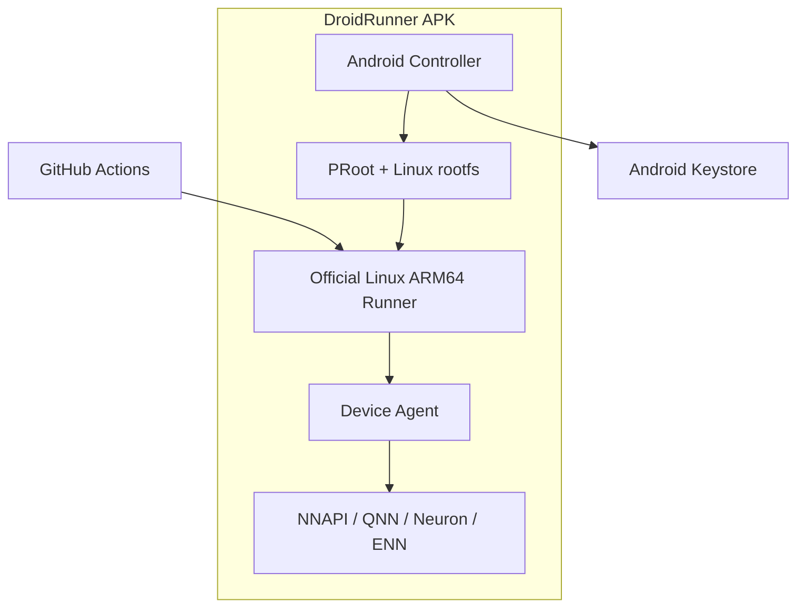

# DroidRunner

**Turn your sleeping Android devices into real-hardware GitHub Actions runners.**

[日本語版 README はこちら](README.ja.md)

**[Site and tutorial](https://droidrunner.m96-chan.dev/)** — what it is, what it looks like, and a step-by-step device setup.

DroidRunner is an Android app that runs an ARM64 Android device as a repository-scoped
GitHub Actions self-hosted runner.

No Termux, no root, no permanent USB connection to a PC. The APK manages a Linux
execution environment and the installation, registration, and background operation of
the official GitHub Actions Runner.

Beyond ordinary ARM64 builds, a job can hand the device a `.tflite` model and get
latency back from the actual accelerator — 0.65 ms on a Tensor G4's EdgeTPU where
the same phone's CPU takes 141 ms. That is the measurement a virtual ARM64 runner
cannot produce, and the reason this exists.

> [!WARNING]
> A self-hosted runner executes whatever code a workflow contains, on your phone.
> Use a device dedicated to CI, and never let it pick up pull requests from forks
> of a public repository. Qualcomm NPUs need an opt-in, because reaching them means
> accepting Qualcomm's terms; MediaTek and Google Tensor work out of the box.

## Goals

- Reuse spare phones and tablets as ARM64 build capacity
- Verify real-hardware differences across Qualcomm, Google Tensor, MediaTek, and Exynos from GitHub Actions
- Classify multiple devices with labels and route jobs to the SoC or NPU they need
- Complete installation, updates, and monitoring with nothing but the Android app
- Accept jobs safely with battery, charging, and thermal state in mind

## Features

- **Single APK** — no Termux or other companion app required
- **No root** — runs a Linux ARM64 environment on top of PRoot
- **Official runner** — uses GitHub's official Linux ARM64 Actions Runner
- **Repository or organization scope** — serve one repository, or every repository in an organization from a single device
- **GitHub App login** — device-flow sign-in with a repository picker; no manual PAT handling
- **Automatic device classification** — generates runner labels from Android API level, SoC, and what the accelerators actually answer
- **Safe credential handling** — encrypts the PAT with the Android Keystore
- **Background standby** — keeps the runner alive with a Foreground Service and a wake lock
- **Tamper detection** — verifies the runtime bundle's SHA-256 before extracting it
- **btop-style dashboard** — live CPU, memory, battery, thermal, disk, and network monitor together with runner status
- **Self-protecting** — holds jobs while the device is unplugged, low, hot, or short on space, and restarts the listener on its own after a failure. A held device really does go offline to GitHub, rather than only believing it has
- **Says what it is doing** — the notification carries the runner state and, when work is held, the reason; a picture-in-picture window keeps it on screen while the phone is used for something else
- **Ephemeral mode** — optionally re-registers and wipes the work directory after every job
- **Usable from another repository** — a composite action, a documented result contract, and exit statuses that tell a refusal apart from a phone that stopped answering

## Architecture overview



Ordinary shells, Git, Node.js, Python, Rust, Go, Gradle, and so on run inside PRoot.
Tests that need Android APIs or the NPU are delegated to the Device Agent inside the
APK through a loopback API.

## Dashboard

The app's main screen is a btop-inspired terminal dashboard rendered with Jetpack
Compose:


- **cpu** — load history graph plus per-core meters with current frequency
  (per-core load uses `/proc/stat` deltas where readable, otherwise the scaling
  frequency relative to each core's maximum)
- **mem / disk** — usage meters and history for RAM and app-private storage
- **pwr/net** — battery level and charging state, battery temperature, Android thermal
  status, and network throughput
- **runner** — runner state (stopped / starting / listening / running job), registered
  repository, uptime, succeeded and failed job counts, how long the device stayed
  offline after a reboot that left it locked, and a live tail of the runner log
- **setup** — a separate screen (⚙) with GitHub sign-in, repository picker, runtime
  install, registration, and the job policy (charging / battery / thermal / storage
  thresholds, ephemeral mode, start-on-boot); a registered runner starts automatically
  on app launch

The runner state is parsed from the official runner's listener output by the foreground
service and streamed to the UI as a `StateFlow`.

## What it does

Everything below runs on real phones — the fleet this is developed against is a
MediaTek MT6899, a Google Tensor G4, and two Snapdragons.

**Running CI**

- Registers as a repository or organization runner from the app, via GitHub App
  device flow — no PAT to create by hand, and the token never enters the Linux side
- Runs the official `linux-arm64` Actions runner under PRoot, with proot shipped
  inside the APK because Android 10+ will not `exec()` from app storage
- Holds jobs while the device is unplugged, low, hot or short on space, and takes
  them again when it recovers. A held device really does go offline to GitHub
- Restarts a listener that dies, backing off if it keeps dying, and alerts once
  rather than once per attempt
- Ephemeral mode re-registers and wipes the work directory per job

**Running models on the silicon**

- A job hands the device a `.tflite` file and gets latency back, per NNAPI driver
- Labels are probe-verified — `nnapi-accelerator` means an accelerator answered,
  not that the SoC name looked promising — and are corrected on GitHub when the
  device disagrees with what it registered
- The Device Agent is reached over loopback with a token minted per job

**Staying honest about itself**

- btop-style dashboard, a notification carrying the runner state and the reason
  jobs are held, and a picture-in-picture window for watching it elsewhere
- Runtime manifests are ECDSA-signed and verified against keys compiled into the
  APK; an install that fails leaves the previous runtime in place
- The log keeps its history across restarts and records the app's own decisions
  next to the runner's output

**Not yet**

| | |
| --- | --- |
| MediaTek Neuron | [#83](https://github.com/m96-chan/DroidRunner/issues/83) — blocked: the public runtime takes `.dla` and nobody can produce one. NNAPI still reaches this hardware |
| Fleet dashboard | [#7](https://github.com/m96-chan/DroidRunner/issues/7) |
| Runtime bundle updates | [#14](https://github.com/m96-chan/DroidRunner/issues/14) |

## Runner labels

In addition to the standard labels the official runner adds, DroidRunner uses these
custom labels.

| Label | Meaning |
| --- | --- |
| `android` | Physical Android device running DroidRunner |
| `arm64` | ARM64 device |
| `android-api-N` | Android API level |
| `soc-*` | Detected SoC information |
| `nnapi` | NNAPI is usable on this device |
| `nnapi-accelerator` | **An accelerator answered the probe** — the label to select on for model work |
| `android-npu` | The SoC family is known to have an NPU. A hint, not a promise |
| `npu-qnn` | **A model has run on this phone's Hexagon** — measured, not guessed |
| `npu-tflite` | Google Tensor / LiteRT candidate |
| `npu-neuron` | MediaTek Neuron candidate |
| `npu-enn` | Samsung ENN candidate |

`npu-tflite`, `npu-neuron` and `npu-enn` come from the SoC name and are **hints**;
`nnapi`, `nnapi-accelerator` and `npu-qnn` come from asking the device and are
measurements. Hints and measurements can disagree, so select on a measurement when a
job needs acceleration or it may quietly get a CPU.

Qualcomm is the case where they disagreed most. Those phones have a Hexagon that
NNAPI cannot reach at all — Qualcomm ships no NNAPI driver, and a Snapdragon
enumerates only `nnapi-reference`, the CPU. `npu-qnn` used to come from the SoC name,
so a job selecting it landed on a device that ran everything on its CPU and said
nothing. It is now emitted only after a model has demonstrably executed on the
Hexagon, which needs the opt-in below.

Labels are recomputed when the app starts and corrected on GitHub if they have
drifted — they used to be frozen at registration, which left one phone announcing
what a much older build believed about it.

### Qualcomm NPU: opt in first

The Hexagon needs Qualcomm's own runtime, which DroidRunner fetches rather than
ships. On a Snapdragon the setup screen offers it:

1. **Review Qualcomm's terms.** Two licences, from two Qualcomm entities, with
   field-of-use restrictions that bind whoever runs the device — so they are yours
   to accept, not ours. The documents are fetched and opened in a PDF reader; what
   is recorded is their digests, so terms that change ask again and a release that
   leaves them alone does not.
2. **Install.** 38MB to download, 102MB on disk, and only the Hexagon generation
   this phone has.
3. **Check the NPU.** Runs a model and reports the split — `all 64 operators on the
   Hexagon, 1.24ms`. Only this earns `npu-qnn`.

Nothing is fetched before step 1, and a phone that never opts in behaves exactly as
before. Devices without a Snapdragon never see the panel.

Measured on a nubia NX769J (Snapdragon 8 Gen 3), EfficientNet-Lite0:

| model | route | median |
| --- | --- | --- |
| int8 | `nnapi-reference` (NNAPI's only option here) | 113.2 ms |
| int8 | CPU | 4.46 ms |
| int8 | **Hexagon** | **1.22 ms** |
| float32 | `nnapi-reference` | 39.8 ms |
| float32 | **Hexagon** | **2.78 ms** |

A job asking for `qnn-htp` is refused rather than quietly run on the CPU:
`droidrunner-device test model x.tflite --device qnn-htp` fails unless the delegate
says how much of the graph it took.

## Example workflows

### Run on any Android device

```yaml
name: Android device test

on:
  workflow_dispatch:

permissions:
  contents: read

jobs:
  test:
    runs-on: [self-hosted, android, arm64]
    steps:
      - uses: actions/checkout@v4
      - run: uname -a
      - run: ./ci/test-arm64.sh
```

### Ask the silicon a question

```yaml
jobs:
  npu:
    runs-on: [self-hosted, android, nnapi-accelerator]
    steps:
      - run: droidrunner-device capabilities                 # device, thermal, drivers
      - run: droidrunner-device devices                      # what NNAPI exposes here
      - run: droidrunner-device test model my-model.tflite --device google-edgetpu --iterations 30
```

`droidrunner-device` is installed into the guest from the APK on every start, so
it stays in step with the agent it talks to.

### Verifying a model, not just timing it

Latency says a graph was *accepted*. Whether it was computed *correctly* is a
different question, and the one a compiler cares about — a lowering bug that only
appears on the vendor's silicon looks exactly like a working compiler when the
check runs on an x86 reference.

```yaml
      - uses: m96-chan/DroidRunner/actions/run-model@main
        id: device
        with:
          model: build/model.tflite
          device: qnn-htp
          inputs: fixtures/input-0.bin      # raw, little-endian, one file per tensor
          output-dir: out
      - run: test "${{ steps.device.outputs.executed }}" = accelerator
      - run: cmp out/output-0.bin fixtures/golden-0.bin
```

That is a differential test between a vendor's NPU and a reference implementation,
running on push — which no cloud runner can do at all. Outputs come back with their
quantization parameters, so int8 bytes do not have to be reverse-engineered into
numbers.

### Sweeps, for when the unit of work is not one model

A few hundred single-op models is a few hundred workflow steps otherwise, which is
the expensive part:

```sh
droidrunner-device test batch manifest.json --output sweep.json
```

One entry back per entry sent, in order. A failing row never ends the sweep — a
sweep is largely *made of* rejections, and each one is the data. `iterations: 0`
means load, delegate and allocate but do not time, for the rows that only ask
whether a graph was accepted.

### What another repository pins to

[`docs/RESULT-CONTRACT.md`](docs/RESULT-CONTRACT.md) — a `schema` on every response,
a `code` from a closed set when something fails, and wrapper exit statuses that
separate the cases a sweep must treat differently:

| exit | meaning |
| --- | --- |
| `0` | it ran |
| `2` | the driver refused the graph — record it and carry on |
| `3` | no such device on this phone |
| `4` | the agent is unreachable — stop |

The prose in `error` is for a person and gets reworded; the code is for a program
and does not.

#### What that actually tells you

EfficientNet-Lite0, median of 30 runs (int8) and 20 (float32), same model and the
same harness on both phones:

| device | driver | int8 | float32 |
| --- | --- | --- | --- |
| Tensor G4 | `google-edgetpu` | **0.65 ms** | 16.7 ms |
| SM8650 | `qnn-htp` (Hexagon) | 1.22 ms | **2.78 ms** |
| MT6899 | `mtk-neuron_shim` | 2.12 ms | 7.29 ms |
| MT6899 | `mtk-mdla_shim` | 2.69 ms | *fell back to the CPU* |
| Tensor G4 | *NNAPI's own choice* | 5.65 ms | — |
| MT6899 | `mtk-dsp_shim` | *fell back to the CPU* | *fell back to the CPU* |
| SM8650 | `nnapi-reference` (CPU) | 113 ms | 39.8 ms |
| Tensor G4 | `nnapi-reference` (CPU) | 141 ms | 64.1 ms |
| MT6899 | `nnapi-reference` (CPU) | 257 ms | 106 ms |

Four things a spec sheet would not have told you:

- **The winner changes with the quantization, across vendors.** EdgeTPU takes int8;
  the Hexagon takes float32 by 2.6× over its nearest rival. Neither phone is "the
  fast one" — it depends on the model you ship.
- **Some of those cells are not measurements of the accelerator at all.** An earlier
  version of this table gave MediaTek's MDLA a float32 number. It never ran there:
  the driver refused the graph and the CPU picked it up. Every run now reports
  [who executed it](docs/RESULT-CONTRACT.md#executed--the-field-most-consumers-branch-on),
  and a fallback says so instead of arriving as a plausible number.
- **Quantizing can decide whether an accelerator is reachable at all**, not just how
  fast it is: MediaTek's MDLA takes int8 and refuses float32 outright.
- **Letting NNAPI choose costs most of the speedup**, and NNAPI cannot reach a
  Hexagon at all — a Snapdragon enumerates only its CPU, which is why that row needs
  the opt-in below.

This is the question a device pool exists to answer, and a virtual ARM64 runner
cannot answer it at all.

## Requirements

### Android device

- ARM64 (`arm64-v8a`)
- Android 9 / API 28 or later
- A few GB of free storage
- A stable network connection
- A charger and some form of cooling are recommended for long-running operation

32-bit ARM, x86 Android, Docker, KVM, and nested virtualization are not supported.

### Install

Releases are published to [GitHub Releases](https://github.com/m96-chan/DroidRunner/releases)
as `droidrunner-v<version>.apk` (arm64 only).

**With [Obtainium](https://github.com/ImranR98/Obtainium)** — recommended, since an
unattended runner should not wait for someone to notice a release:

1. Add app → paste `https://github.com/m96-chan/DroidRunner`
2. APK filter (only needed if a release ever carries several assets):
   `droidrunner-v.*\.apk`

Obtainium then updates the app in place as new tags are published.

**By hand**: download the APK from the latest release and install it.

> [!NOTE]
> Updates install over the existing app only while the signing key stays the same.
> Reinstalling from a differently signed source — your own build, say — requires
> uninstalling first, which discards the runner registration and the stored GitHub
> credentials, so you would have to register the device again.

Google Play is not a distribution target: the app exists to execute code fetched from
outside the store, which runs into the Device & Network Abuse policy on dynamic code
execution.

F-Droid is not one either. Its promise is that everything running on your device was
built from source, and this app cannot honour it: on first setup it downloads a
~200MB Ubuntu rootfs and GitHub's prebuilt runner, and then executes whatever a
workflow contains. Building the APK from source would guarantee the least dangerous
part of what actually runs. Releases here, or Obtainium, serve the same people
without that mismatch.

## Build environment

- JDK 17
- Android SDK 35
- Android Studio (any version supporting AGP 9.4); Gradle comes from the wrapper

## Build

```bash
git clone <repository-url>
cd DroidRunner
ANDROID_NDK_ROOT=$ANDROID_HOME/ndk/<version> runtime/build-proot.sh
./gradlew assembleDebug
```

`build-proot.sh` cross-compiles proot with the NDK into `app/src/main/jniLibs/`
(required once — Android 10+ can only exec binaries shipped inside the APK).

Resulting APK:

```text
app/build/outputs/apk/debug/app-debug.apk
```

This repository also contains a GitHub Actions build definition.

### Publishing a release

Pushing a `v*` tag builds and publishes the APK. `versionName` and `versionCode` are
derived from the tag, so an update always outranks the version it replaces; a local
build without a tag reports `0.0.0-dev`.

Releases must be signed with a stable key, and the build refuses to produce a tagged
release with the debug key. Create one keystore, keep it safe, and store it in the
repository secrets:

```bash
keytool -genkey -v -keystore release.jks -alias droidrunner \
    -keyalg RSA -keysize 4096 -validity 10000
base64 -w0 release.jks   # → ANDROID_KEYSTORE_BASE64
```

Secrets: `ANDROID_KEYSTORE_BASE64`, `ANDROID_KEYSTORE_PASSWORD`, `ANDROID_KEY_ALIAS`,
`ANDROID_KEY_PASSWORD`. Losing the key means users have to uninstall and re-register
their devices to move to a new one.

## Setup

1. Install the DroidRunner APK on the device
2. Tap **Connect GitHub** on the setup screen — an 8-character code is shown (and
   copied to the clipboard); enter it at `github.com/login/device` and approve
3. If the DroidRunner GitHub App is not installed on any of your repositories, the app
   prompts you to install it — install it on the repository this runner should serve
4. Choose the **scope** — a single repository, or an organization the app is
   installed on — pick the target, and tap **Register** . The runtime bundle
   (~200MB) is discovered from the newest `runtime-*` GitHub Release and installed
   automatically

   > [!WARNING]
   > An organization runner accepts jobs from **every repository in the
   > organization** unless you place it in a [runner group](https://docs.github.com/en/actions/hosting-your-own-runners/managing-self-hosted-runners/managing-access-to-self-hosted-runners-using-groups)
   > with an allow-list. On a device that executes workflow code, that is a
   > materially wider trust boundary than repository scope — the repository
   > default exists for a reason.

   Changing the target later is possible: stop the runner, pick the new target,
   and the button offers **Re-register**.
5. Done — the runner starts automatically whenever the app launches
   (Start/Stop controls live in the dashboard's runner panel)

The app resolves the runtime from the repository named by the
`droidrunner.runtimeRepo` build property. A manual manifest URL override lives
under `advanced` for GitHub Enterprise Server or self-hosted bundles. Maintainers
publish new bundles with the **Runtime bundle** workflow (see `runtime/README.md`).

Sign-in uses the GitHub App device flow, so no client secret is embedded in the APK
and no PAT has to be created by hand. The user token is encrypted with the Android
Keystore and never enters the Linux environment; the controller exchanges it for a
short-lived registration token. The refresh token is stored the same way, and the
sign-in is renewed before it expires (and again if GitHub rejects a token anyway),
so an ephemeral device keeps re-registering without anyone opening the app. If a
renewal is refused, the device says so in a notification: that one does need a
person.

A manual fallback (`advanced: manual PAT setup`) accepts a fine-grained PAT with the
repository Administration read/write permission, for GitHub Enterprise Server or
builds without a GitHub App.

### GitHub App registration (for self-builders)

The device flow needs a GitHub App identity. Register one once (free, no server
required):

1. GitHub → Settings → Developer settings → **New GitHub App**
2. Repository permission **Administration: Read and write**; no webhook
3. Enable **Device flow**
4. Optional: opt out of user access token expiration (Optional features). The app
   now stores the refresh token and renews the sign-in before it lapses, so this is
   advice for a quieter setup rather than something the app depends on
5. Put the public identifiers into `gradle.properties`:

```properties
droidrunner.githubAppClientId=Iv1.xxxxxxxxxxxxxxxx
droidrunner.githubAppSlug=your-app-slug
```

Without these values the app hides the GitHub login and offers only the manual PAT
setup.

## Runtime bundle

The Linux environment is not embedded in the APK; it is downloaded during first-time
setup. This keeps the APK small and lets the rootfs and the official runner update
independently of the APK. No companion app is needed.

proot itself ships **inside the APK** as jniLibs and is executed from
`nativeLibraryDir`, because Android 10+ refuses to `exec()` binaries stored in app
data. The downloaded bundle is therefore data only:

```text
bundle/
├── rootfs/            Ubuntu ARM64 base + runner dependencies
│   ├── bin/
│   └── usr/
└── home/
    └── runner/        official Actions runner (linux-arm64)
        ├── config.sh
        ├── run.sh
        └── bin/Runner.Listener
```

The **Runtime bundle** CI workflow builds and publishes this to a GitHub Release
together with a matching manifest:

```json
{
  "version": "runner-2.337.0-ubuntu-24.04.3",
  "url": "https://github.com/OWNER/DroidRunner/releases/download/runtime-0.1.0/droidrunner-runtime-arm64.tar.gz",
  "sha256": "..."
}
```

The SHA-256 proves the archive matches the manifest. It says nothing about who wrote
the manifest — and whoever can replace a manifest can point devices at a rootfs of
their choosing, which is where CI jobs execute. So the manifest is signed too, and the
app verifies it against public keys compiled into the APK before anything is
downloaded.

Generate a signing key once, keep it safe, and put the private key in the repository
secret `RUNTIME_SIGNING_KEY`:

```bash
openssl ecparam -genkey -name prime256v1 -noout -out runtime-signing.pem
openssl ec -in runtime-signing.pem -pubout -outform DER | base64 -w0
```

Put that public key in `gradle.properties`:

```properties
droidrunner.runtimeSigningKeys=MFkwEwYHKoZIzj0CAQYIKoZIzj0DAQcDQgAE...
```

Several keys can be trusted at once, comma-separated, so a key can be rotated: ship the
new one in a release, sign with either while both are trusted, then drop the old one.

A build with no key configured cannot verify anything and says so during install rather
than pretending otherwise; a build that *does* carry a key refuses an unsigned or
wrongly signed manifest.

## NPU Device Agent

A Linux process inside PRoot cannot call Android's NNAPI or vendor Java APIs directly.
NPU tests therefore cross this boundary:

```text
GitHub job
  └─ droidrunner-device CLI
      └─ 127.0.0.1 + job capability token
          └─ isolated Android Service
              └─ NNAPI / QNN / Neuron / ENN adapter
```

The design never loads arbitrary `.so` files into the controller. Approved adapters run
in an isolated service and accept only test requests with explicit models, inputs,
timeouts, and output destinations.

See [`docs/ARCHITECTURE.md`](docs/ARCHITECTURE.md) for the detailed design.

## Security

A self-hosted runner executes whatever code the workflow contains, on your device.

- Never auto-run pull requests from forks of public repositories
- Minimize repository and PAT permissions
- Do not casually combine `pull_request_target` with self-hosted runners
- Use devices wiped and dedicated to CI, not devices in personal use
- Keep secrets out of the runner work directory
- Enable ephemeral runners, which re-register and wipe the work directory after each job

PRoot is a compatibility layer, not a strong security boundary like Docker or a VM.

## Limitations

- Docker-based actions and service containers are not available
- PRoot's syscall translation adds overhead
- Android battery optimization and vendor task killers can interfere
- Start-on-boot resumes the runner once the device is **unlocked**, not when it boots:
  Android holds `BOOT_COMPLETED` back while the user is credential-locked, and the
  runtime bundle and the stored credentials sit in credential-encrypted storage that is
  unreadable until first unlock. A device dedicated to CI should therefore have no
  secure lock screen — otherwise a power cut takes CI down until someone picks the
  phone up. The dashboard reports how long a boot went unserved
  ([#41](https://github.com/m96-chan/DroidRunner/issues/41))
- Android 12+ restricts how foreground services may be started
- Some actions do not support ARM64 or a Linux environment on Android
- The rootfs and build caches can consume significant storage

## Roadmap

- [x] Stabilize the runtime bootstrap on real devices, following GABE
- [x] Job admission control based on battery, charging, thermal, and free storage
- [x] Listener crash recovery with restart backoff
- [x] Ephemeral runners with post-job cleanup
- [x] Organization-scoped runners (one device serving a whole organization)
- [x] Device Agent with per-job capability tokens
- [x] NNAPI capability probe and smoke test — run on every CI build against a real device
- [x] Run a caller-supplied model rather than the built-in benchmarks
- [x] Reach Qualcomm NPUs, which NNAPI cannot ([#82](https://github.com/m96-chan/DroidRunner/issues/82)) — 1.22ms against the CPU's 4.46ms
- [x] Run a caller-supplied model's own inputs and return its outputs ([#92](https://github.com/m96-chan/DroidRunner/issues/92))
- [x] Report which driver actually ran the graph, not which one was asked for ([#93](https://github.com/m96-chan/DroidRunner/issues/93))
- [x] A documented result contract and a composite action other repositories can use ([#95](https://github.com/m96-chan/DroidRunner/issues/95))
- [x] Run a manifest of models in one request ([#94](https://github.com/m96-chan/DroidRunner/issues/94))
- [ ] MediaTek Neuron — blocked: the public runtime takes `.dla` and nobody can produce one ([#83](https://github.com/m96-chan/DroidRunner/issues/83))
- [ ] An operator support matrix measured on silicon rather than read off a datasheet ([#96](https://github.com/m96-chan/DroidRunner/issues/96))
- [ ] Samsung Exynos — deprioritised: few devices, and those that exist are either
      flagship-priced or bargain oddities, so a test phone is hard to justify
- [x] Runtime manifest signature verification
- [x] Notification carrying the runner state, the hold reason, and alerts for what GitHub cannot see
- [x] Picture-in-picture window for watching a runner while using the phone
- [x] Report how long a reboot left the device unserved because it was locked ([#41](https://github.com/m96-chan/DroidRunner/issues/41))
- [x] Reinstall a missing runtime without re-registering, and never leave a device with none
- [x] Renew the GitHub sign-in instead of losing it when the token expires
- [x] Stop holding jobs for a condition that lasts one sample
- [x] Skip unreadable entries in GitHub responses rather than losing the whole list
- [ ] Notify or auto-install when the runtime bundle is out of date ([#14](https://github.com/m96-chan/DroidRunner/issues/14))
- [ ] Fleet dashboard showing the state of multiple devices ([#7](https://github.com/m96-chan/DroidRunner/issues/7))
- [ ] Generate a GPL-compliant runtime source archive and SBOM

## Related projects

- [GitHub Actions Runner](https://github.com/actions/runner)
- [Godot Android Editor Build Environment (GABE)](https://github.com/godotengine/android-editor-buildenv-app)
- [PRoot](https://github.com/termux/proot)
- [UserLAnd](https://github.com/CypherpunkArmory/UserLAnd)

DroidRunner is heavily inspired by GABE, in particular its design of managing a PRoot
environment from an Android service.

## License

DroidRunner is released under the **GNU General Public License v2.0 only
(`GPL-2.0-only`)** — see [`LICENSE`](LICENSE).

The APK also ships third-party components under their own licenses:

| Component | License | Corresponding source |
| --- | --- | --- |
| [PRoot](https://github.com/termux/proot) (`libproot.so`, loaders) | GPL-2.0 | commit pinned in [`runtime/build-proot.sh`](runtime/build-proot.sh), patches in [`runtime/patches/`](runtime/patches) |
| [talloc](https://talloc.samba.org/) (statically linked into proot) | LGPL-3.0 | version pinned in `runtime/build-proot.sh` |

The runtime bundle carries more: the [GitHub Actions Runner](https://github.com/actions/runner)
(MIT) and an Ubuntu rootfs whose packages keep their own licenses. If you distribute a
bundle, provide the corresponding sources, patches, build instructions, and copyright
notices along with it — `runtime/build-bundle.sh` pins exactly what goes in.

The app's About screen lists the same information on the device.
