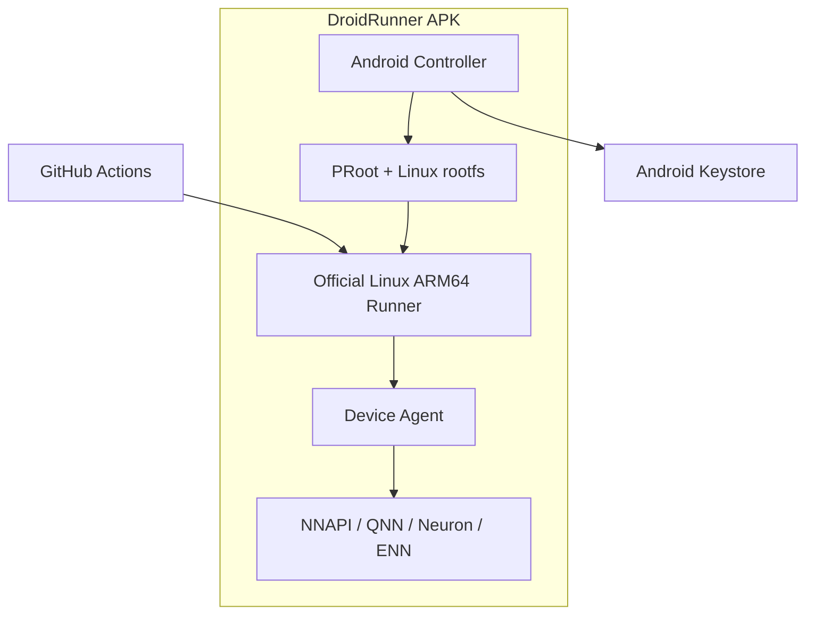
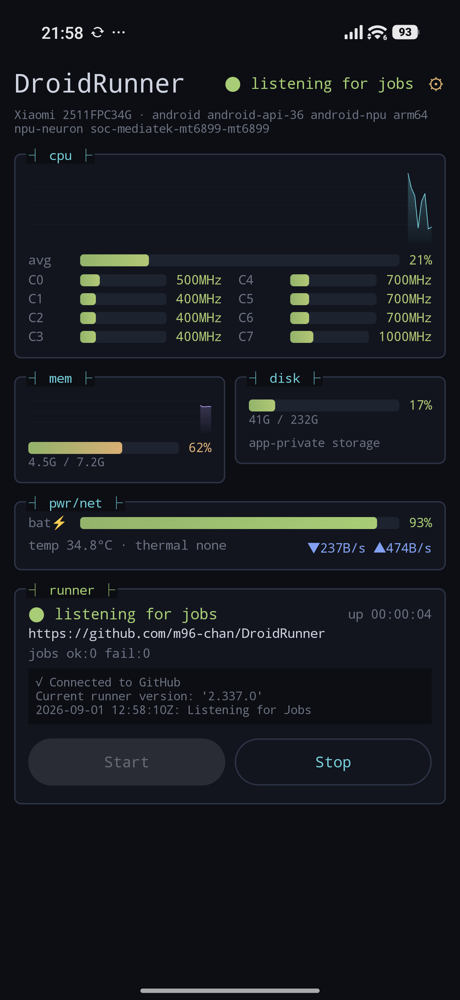

# DroidRunner

**Turn your sleeping Android devices into real-hardware GitHub Actions runners.**

[日本語版 README はこちら](README.ja.md)

DroidRunner is an Android app that runs an ARM64 Android device as a repository-scoped
GitHub Actions self-hosted runner.

No Termux, no root, no permanent USB connection to a PC. The APK manages a Linux
execution environment and the installation, registration, and background operation of
the official GitHub Actions Runner. Beyond ordinary ARM64 builds, the long-term goal is
a device pool that lets CI exercise Android-specific NNAPI and vendor NPU backends on
real hardware.

> [!WARNING]
> This is an early proof of concept. The runner-management basics are implemented, but
> the distributable runtime bundle and the NPU Device Agent are still in development.
> Do not use it in production or with repositories you do not trust.

## Goals

- Reuse spare phones and tablets as ARM64 build capacity
- Verify real-hardware differences across Qualcomm, Google Tensor, MediaTek, and Exynos from GitHub Actions
- Classify multiple devices with labels and route jobs to the SoC or NPU they need
- Complete installation, updates, and monitoring with nothing but the Android app
- Accept jobs safely with battery, charging, and thermal state in mind

## Features

- **Single APK** — no Termux or other companion app required
- **No root** — runs a Linux ARM64 environment on top of PRoot
- **Official runner** — uses GitHub's official Linux ARM64 Actions Runner
- **Repository-scoped** — the initial version registers with exactly one repository
- **GitHub App login** — device-flow sign-in with a repository picker; no manual PAT handling
- **Automatic device classification** — generates runner labels from Android API level, SoC, and NPU hints
- **Safe credential handling** — encrypts the PAT with the Android Keystore
- **Background standby** — keeps the runner alive with a Foreground Service and a wake lock
- **Tamper detection** — verifies the runtime bundle's SHA-256 before extracting it
- **btop-style dashboard** — live CPU, memory, battery, thermal, disk, and network monitor together with runner status

## Architecture overview



Ordinary shells, Git, Node.js, Python, Rust, Go, Gradle, and so on run inside PRoot.
Tests that need Android APIs or the NPU are delegated to the Device Agent inside the
APK through a loopback API.

## Dashboard

The app's main screen is a btop-inspired terminal dashboard rendered with Jetpack
Compose:




- **cpu** — load history graph plus per-core meters with current frequency
  (per-core load uses `/proc/stat` deltas where readable, otherwise the scaling
  frequency relative to each core's maximum)
- **mem / disk** — usage meters and history for RAM and app-private storage
- **pwr/net** — battery level and charging state, battery temperature, Android thermal
  status, and network throughput
- **runner** — runner state (stopped / starting / listening / running job), registered
  repository, uptime, succeeded and failed job counts, and a live tail of the runner log
- **setup** — a separate screen (⚙) with GitHub sign-in, repository picker, runtime
  install, and registration; a registered runner starts automatically on app launch

The runner state is parsed from the official runner's listener output by the foreground
service and streamed to the UI as a `StateFlow`.

## Implementation status

| Feature | Status |
| --- | --- |
| btop-style dashboard UI | Implemented (PoC) |
| GitHub App device-flow login + repository picker | Implemented (PoC) |
| Repository registration token exchange | Implemented (PoC) |
| Credential storage in the Keystore (user token / PAT) | Implemented (PoC) |
| Runtime bundle download + SHA-256 verification | Implemented (PoC) |
| proot NDK build (in-APK) + runtime bundle CI | Implemented (PoC) |
| Official runner under PRoot | Verified on-device (job executed successfully) |
| Foreground service with runner-state parsing | Implemented (PoC) |
| SoC/NPU candidate labels | Implemented (PoC) |
| Charging / thermal / storage admission control | Designed, not implemented |
| NPU Device Agent | Designed, not implemented |
| Multi-device fleet dashboard | Not implemented |
| Signed runtime manifest | Not implemented |

## Runner labels

In addition to the standard labels the official runner adds, DroidRunner uses these
custom labels.

| Label | Meaning |
| --- | --- |
| `android` | Physical Android device running DroidRunner |
| `arm64` | ARM64 device |
| `android-api-N` | Android API level |
| `soc-*` | Detected SoC information |
| `android-npu` | Candidate device with an NPU |
| `android-no-npu` | Device where no NPU was detected |
| `npu-qnn` | Qualcomm QNN candidate |
| `npu-tflite` | Google Tensor / LiteRT candidate |
| `npu-neuron` | MediaTek Neuron candidate |
| `npu-enn` | Samsung ENN candidate |

Classification by SoC name is only a hint. In the final design the Device Agent probes
each backend and publishes only the labels it could actually verify.

## Example workflows

### Run on any Android device

```yaml
name: Android device test

on:
  workflow_dispatch:

permissions:
  contents: read

jobs:
  test:
    runs-on: [self-hosted, android, arm64]
    steps:
      - uses: actions/checkout@v4
      - run: uname -a
      - run: ./ci/test-arm64.sh
```

### Target a Qualcomm NPU device

```yaml
jobs:
  qnn-test:
    runs-on: [self-hosted, android, android-npu, npu-qnn]
    steps:
      - uses: actions/checkout@v4
      - run: droidrunner-device test qnn ./models/model.onnx
```

The `droidrunner-device` CLI and the Device Agent API are not implemented yet; the
example above shows the planned interface.

## Requirements

### Android device

- ARM64 (`arm64-v8a`)
- Android 9 / API 28 or later
- A few GB of free storage
- A stable network connection
- A charger and some form of cooling are recommended for long-running operation

32-bit ARM, x86 Android, Docker, KVM, and nested virtualization are not supported.

### Build environment

- JDK 17
- Android SDK 35
- Android Studio Ladybug or later, or Gradle 8.10+

## Build

```bash
git clone <repository-url>
cd DroidRunner
ANDROID_NDK_ROOT=$ANDROID_HOME/ndk/<version> runtime/build-proot.sh
gradle assembleDebug
```

`build-proot.sh` cross-compiles proot with the NDK into `app/src/main/jniLibs/`
(required once — Android 10+ can only exec binaries shipped inside the APK).

Resulting APK:

```text
app/build/outputs/apk/debug/app-debug.apk
```

This repository also contains a GitHub Actions build definition.

## Setup

1. Run the **Runtime bundle** GitHub Actions workflow with a `release_tag`
   (or build with `runtime/build-bundle.sh` on an ARM64 host) — see
   `runtime/README.md`
2. Copy the published `runtime-manifest.json` asset URL from the release
3. Install the DroidRunner APK on the device
4. Tap **Connect GitHub** in the setup panel — an 8-character code is shown (and
   copied to the clipboard); enter it at `github.com/login/device` and approve
5. If the DroidRunner GitHub App is not installed on any of your repositories, the app
   prompts you to install it — install it on the repository this runner should serve
6. Pick the repository from the list
7. Enter the runtime manifest URL and tap **Install runtime**
8. Tap **Register \<owner\>/\<repo\>**
9. Done — the runner starts automatically whenever the app launches
   (Start/Stop controls live in the dashboard's runner panel)

Sign-in uses the GitHub App device flow, so no client secret is embedded in the APK
and no PAT has to be created by hand. The user token is encrypted with the Android
Keystore and never enters the Linux environment; the controller exchanges it for a
short-lived registration token.

A manual fallback (`advanced: manual PAT setup`) accepts a fine-grained PAT with the
repository Administration read/write permission, for GitHub Enterprise Server or
builds without a GitHub App.

### GitHub App registration (for self-builders)

The device flow needs a GitHub App identity. Register one once (free, no server
required):

1. GitHub → Settings → Developer settings → **New GitHub App**
2. Repository permission **Administration: Read and write**; no webhook
3. Enable **Device flow**
4. Recommended: opt out of user access token expiration (Optional features), so the
   login does not need refresh handling
5. Put the public identifiers into `gradle.properties`:

```properties
droidrunner.githubAppClientId=Iv1.xxxxxxxxxxxxxxxx
droidrunner.githubAppSlug=your-app-slug
```

Without these values the app hides the GitHub login and offers only the manual PAT
setup.

## Runtime bundle

The Linux environment is not embedded in the APK; it is downloaded during first-time
setup. This keeps the APK small and lets the rootfs and the official runner update
independently of the APK. No companion app is needed.

proot itself ships **inside the APK** as jniLibs and is executed from
`nativeLibraryDir`, because Android 10+ refuses to `exec()` binaries stored in app
data. The downloaded bundle is therefore data only:

```text
bundle/
├── rootfs/            Ubuntu ARM64 base + runner dependencies
│   ├── bin/
│   └── usr/
└── home/
    └── runner/        official Actions runner (linux-arm64)
        ├── config.sh
        ├── run.sh
        └── bin/Runner.Listener
```

The **Runtime bundle** CI workflow builds and publishes this to a GitHub Release
together with a matching manifest:

```json
{
  "version": "runner-2.337.0-ubuntu-24.04.3",
  "url": "https://github.com/OWNER/DroidRunner/releases/download/runtime-0.1.0/droidrunner-runtime-arm64.tar.gz",
  "sha256": "..."
}
```

SHA-256 detects corruption and accidental replacement, but it cannot defend against an
attacker who replaces the manifest itself. Production releases will add manifest
signature verification against a public key embedded in the APK.

## NPU Device Agent

A Linux process inside PRoot cannot call Android's NNAPI or vendor Java APIs directly.
NPU tests therefore cross this boundary:

```text
GitHub job
  └─ droidrunner-device CLI
      └─ 127.0.0.1 + job capability token
          └─ isolated Android Service
              └─ NNAPI / QNN / Neuron / ENN adapter
```

The design never loads arbitrary `.so` files into the controller. Approved adapters run
in an isolated service and accept only test requests with explicit models, inputs,
timeouts, and output destinations.

See [`docs/ARCHITECTURE.md`](docs/ARCHITECTURE.md) for the detailed design.

## Security

A self-hosted runner executes whatever code the workflow contains, on your device.

- Never auto-run pull requests from forks of public repositories
- Minimize repository and PAT permissions
- Do not casually combine `pull_request_target` with self-hosted runners
- Use devices wiped and dedicated to CI, not devices in personal use
- Keep secrets out of the runner work directory
- Adopt ephemeral runners that clean the work directory after each job (planned)

PRoot is a compatibility layer, not a strong security boundary like Docker or a VM.

## Limitations

- Docker-based actions and service containers are not available
- PRoot's syscall translation adds overhead
- Android battery optimization and vendor task killers can interfere
- Android 12+ restricts how foreground services may be started
- Some actions do not support ARM64 or a Linux environment on Android
- The rootfs and build caches can consume significant storage

## Roadmap

- [ ] Stabilize the runtime bootstrap on real devices, following GABE
- [ ] Generate a GPL-compliant runtime source archive and SBOM
- [ ] Job admission control based on battery, charging, thermal, and free storage
- [ ] Automatic runner updates and crash recovery
- [ ] Device Agent with per-job capability tokens
- [ ] NNAPI capability probe and smoke test
- [ ] QNN / LiteRT / MediaTek Neuron / Samsung ENN adapters
- [ ] Ephemeral runners with post-job cleanup
- [ ] Fleet dashboard showing the state of multiple devices
- [ ] Runtime manifest signature verification

## Related projects

- [GitHub Actions Runner](https://github.com/actions/runner)
- [Godot Android Editor Build Environment (GABE)](https://github.com/godotengine/android-editor-buildenv-app)
- [PRoot](https://github.com/termux/proot)
- [UserLAnd](https://github.com/CypherpunkArmory/UserLAnd)

DroidRunner is heavily inspired by GABE, in particular its design of managing a PRoot
environment from an Android service.

## License

DroidRunner will be released under the **GNU General Public License v2.0 only
(`GPL-2.0-only`)**.

PRoot, the Linux rootfs, the GitHub Actions Runner, and every bundled package keep
their own licenses. If you distribute a runtime bundle, provide the corresponding
sources, patches, build instructions, and copyright notices along with it.
