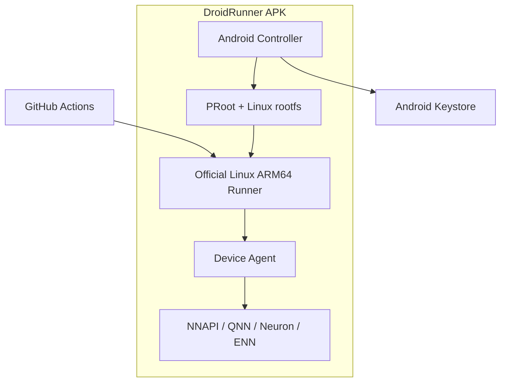

# DroidRunner

**Turn your sleeping Android devices into real-hardware GitHub Actions runners.**

[日本語版 README はこちら](README.ja.md)

**[Site and tutorial](https://www.m96-chan.dev/DroidRunner/)** — what it is, what it looks like, and a step-by-step device setup.

DroidRunner is an Android app that runs an ARM64 Android device as a repository-scoped
GitHub Actions self-hosted runner.

No Termux, no root, no permanent USB connection to a PC. The APK manages a Linux
execution environment and the installation, registration, and background operation of
the official GitHub Actions Runner. Beyond ordinary ARM64 builds, the long-term goal is
a device pool that lets CI exercise Android-specific NNAPI and vendor NPU backends on
real hardware.

> [!WARNING]
> This is an early proof of concept. The runner-management basics are implemented, but
> the NPU Device Agent runs built-in benchmarks only, and arbitrary model execution
> is still in development.
> Do not use it in production or with repositories you do not trust.

## Goals

- Reuse spare phones and tablets as ARM64 build capacity
- Verify real-hardware differences across Qualcomm, Google Tensor, MediaTek, and Exynos from GitHub Actions
- Classify multiple devices with labels and route jobs to the SoC or NPU they need
- Complete installation, updates, and monitoring with nothing but the Android app
- Accept jobs safely with battery, charging, and thermal state in mind

## Features

- **Single APK** — no Termux or other companion app required
- **No root** — runs a Linux ARM64 environment on top of PRoot
- **Official runner** — uses GitHub's official Linux ARM64 Actions Runner
- **Repository or organization scope** — serve one repository, or every repository in an organization from a single device
- **GitHub App login** — device-flow sign-in with a repository picker; no manual PAT handling
- **Automatic device classification** — generates runner labels from Android API level, SoC, and NPU hints
- **Safe credential handling** — encrypts the PAT with the Android Keystore
- **Background standby** — keeps the runner alive with a Foreground Service and a wake lock
- **Tamper detection** — verifies the runtime bundle's SHA-256 before extracting it
- **btop-style dashboard** — live CPU, memory, battery, thermal, disk, and network monitor together with runner status
- **Self-protecting** — holds jobs while the device is unplugged, low, hot, or short on space, and restarts the listener on its own after a failure
- **Ephemeral mode** — optionally re-registers and wipes the work directory after every job

## Architecture overview



Ordinary shells, Git, Node.js, Python, Rust, Go, Gradle, and so on run inside PRoot.
Tests that need Android APIs or the NPU are delegated to the Device Agent inside the
APK through a loopback API.

## Dashboard

The app's main screen is a btop-inspired terminal dashboard rendered with Jetpack
Compose:


- **cpu** — load history graph plus per-core meters with current frequency
  (per-core load uses `/proc/stat` deltas where readable, otherwise the scaling
  frequency relative to each core's maximum)
- **mem / disk** — usage meters and history for RAM and app-private storage
- **pwr/net** — battery level and charging state, battery temperature, Android thermal
  status, and network throughput
- **runner** — runner state (stopped / starting / listening / running job), registered
  repository, uptime, succeeded and failed job counts, and a live tail of the runner log
- **setup** — a separate screen (⚙) with GitHub sign-in, repository picker, runtime
  install, registration, and the job policy (charging / battery / thermal / storage
  thresholds, ephemeral mode, start-on-boot); a registered runner starts automatically
  on app launch

The runner state is parsed from the official runner's listener output by the foreground
service and streamed to the UI as a `StateFlow`.

## Implementation status

| Feature | Status |
| --- | --- |
| btop-style dashboard UI | Implemented (PoC) |
| GitHub App device-flow login + repository picker | Implemented (PoC) |
| Repository registration token exchange | Implemented (PoC) |
| Organization-scoped runners | Implemented (PoC) |
| Credential storage in the Keystore (user token / PAT) | Implemented (PoC) |
| Runtime bundle download + SHA-256 verification | Implemented (PoC) |
| proot NDK build (in-APK) + runtime bundle CI | Implemented (PoC) |
| Official runner under PRoot | Verified on-device (job executed successfully) |
| Foreground service with runner-state parsing | Implemented (PoC) |
| SoC/NPU candidate labels | Implemented (PoC) |
| Charging / thermal / storage admission control | Implemented (PoC) |
| Ephemeral runners with post-job cleanup | Implemented (PoC) |
| Listener crash recovery with restart backoff | Implemented (PoC) |
| NPU Device Agent (loopback API, NNAPI probes, CLI) | Implemented (PoC) |
| Probe-verified NNAPI labels | Implemented (PoC) |
| Arbitrary model (`.tflite`) execution | Designed, not implemented |
| Multi-device fleet dashboard | Not implemented |
| Signed runtime manifest | Implemented (PoC) |

## Runner labels

In addition to the standard labels the official runner adds, DroidRunner uses these
custom labels.

| Label | Meaning |
| --- | --- |
| `android` | Physical Android device running DroidRunner |
| `arm64` | ARM64 device |
| `android-api-N` | Android API level |
| `soc-*` | Detected SoC information |
| `android-npu` | Candidate device with an NPU |
| `android-no-npu` | Device where no NPU was detected |
| `npu-qnn` | Qualcomm QNN candidate |
| `npu-tflite` | Google Tensor / LiteRT candidate |
| `npu-neuron` | MediaTek Neuron candidate |
| `npu-enn` | Samsung ENN candidate |

Classification by SoC name is only a hint. In the final design the Device Agent probes
each backend and publishes only the labels it could actually verify.

## Example workflows

### Run on any Android device

```yaml
name: Android device test

on:
  workflow_dispatch:

permissions:
  contents: read

jobs:
  test:
    runs-on: [self-hosted, android, arm64]
    steps:
      - uses: actions/checkout@v4
      - run: uname -a
      - run: ./ci/test-arm64.sh
```

### Exercise the device's NPU

```yaml
jobs:
  npu-test:
    runs-on: [self-hosted, android, nnapi-accelerator]
    steps:
      - run: droidrunner-device capabilities        # device info, thermal, NNAPI drivers
      - run: droidrunner-device bench-all           # CONV_2D across every driver
      - run: droidrunner-device test conv --device mtk-neuron_shim --iterations 50
```

`droidrunner-device` ships in the runtime bundle and talks to the Device Agent for
you. Sample output from a MediaTek MT6899 phone:

```text
DEVICE                       AVG_US     GFLOPS
mtk-dsp_shim                      - compilation_finish
mtk-mdla_shim                     - compilation_finish
mtk-neuron_shim              4148.9       4.55
nnapi-reference              1107.7      17.04
```

Today the agent runs built-in ADD and CONV_2D benchmarks; running your own model is
the next milestone (see issue #4). Drivers that reject the float32 convolution
(here the DSP and MDLA) expect quantized models — which is exactly why labels come
from probes rather than SoC names.

## Requirements

### Android device

- ARM64 (`arm64-v8a`)
- Android 9 / API 28 or later
- A few GB of free storage
- A stable network connection
- A charger and some form of cooling are recommended for long-running operation

32-bit ARM, x86 Android, Docker, KVM, and nested virtualization are not supported.

### Install

Releases are published to [GitHub Releases](https://github.com/m96-chan/DroidRunner/releases)
as `droidrunner-v<version>.apk` (arm64 only).

**With [Obtainium](https://github.com/ImranR98/Obtainium)** — recommended, since an
unattended runner should not wait for someone to notice a release:

1. Add app → paste `https://github.com/m96-chan/DroidRunner`
2. APK filter (only needed if a release ever carries several assets):
   `droidrunner-v.*\.apk`

Obtainium then updates the app in place as new tags are published.

**By hand**: download the APK from the latest release and install it.

> [!NOTE]
> Updates install over the existing app only while the signing key stays the same.
> Reinstalling from a differently signed source (a future F-Droid build, or your own
> build) requires uninstalling first, which discards the runner registration and the
> stored GitHub credentials — you would have to register the device again.

Google Play is not a distribution target: the app exists to execute code fetched from
outside the store, which runs into the Device & Network Abuse policy on dynamic code
execution.

## Build environment

- JDK 17
- Android SDK 35
- Android Studio Ladybug or later, or Gradle 8.10+

## Build

```bash
git clone <repository-url>
cd DroidRunner
ANDROID_NDK_ROOT=$ANDROID_HOME/ndk/<version> runtime/build-proot.sh
gradle assembleDebug
```

`build-proot.sh` cross-compiles proot with the NDK into `app/src/main/jniLibs/`
(required once — Android 10+ can only exec binaries shipped inside the APK).

Resulting APK:

```text
app/build/outputs/apk/debug/app-debug.apk
```

This repository also contains a GitHub Actions build definition.

### Publishing a release

Pushing a `v*` tag builds and publishes the APK. `versionName` and `versionCode` are
derived from the tag, so an update always outranks the version it replaces; a local
build without a tag reports `0.0.0-dev`.

Releases must be signed with a stable key, and the build refuses to produce a tagged
release with the debug key. Create one keystore, keep it safe, and store it in the
repository secrets:

```bash
keytool -genkey -v -keystore release.jks -alias droidrunner \
    -keyalg RSA -keysize 4096 -validity 10000
base64 -w0 release.jks   # → ANDROID_KEYSTORE_BASE64
```

Secrets: `ANDROID_KEYSTORE_BASE64`, `ANDROID_KEYSTORE_PASSWORD`, `ANDROID_KEY_ALIAS`,
`ANDROID_KEY_PASSWORD`. Losing the key means users have to uninstall and re-register
their devices to move to a new one.

## Setup

1. Install the DroidRunner APK on the device
2. Tap **Connect GitHub** on the setup screen — an 8-character code is shown (and
   copied to the clipboard); enter it at `github.com/login/device` and approve
3. If the DroidRunner GitHub App is not installed on any of your repositories, the app
   prompts you to install it — install it on the repository this runner should serve
4. Choose the **scope** — a single repository, or an organization the app is
   installed on — pick the target, and tap **Register** . The runtime bundle
   (~200MB) is discovered from the newest `runtime-*` GitHub Release and installed
   automatically

   > [!WARNING]
   > An organization runner accepts jobs from **every repository in the
   > organization** unless you place it in a [runner group](https://docs.github.com/en/actions/hosting-your-own-runners/managing-self-hosted-runners/managing-access-to-self-hosted-runners-using-groups)
   > with an allow-list. On a device that executes workflow code, that is a
   > materially wider trust boundary than repository scope — the repository
   > default exists for a reason.

   Changing the target later is possible: stop the runner, pick the new target,
   and the button offers **Re-register**.
5. Done — the runner starts automatically whenever the app launches
   (Start/Stop controls live in the dashboard's runner panel)

The app resolves the runtime from the repository named by the
`droidrunner.runtimeRepo` build property. A manual manifest URL override lives
under `advanced` for GitHub Enterprise Server or self-hosted bundles. Maintainers
publish new bundles with the **Runtime bundle** workflow (see `runtime/README.md`).

Sign-in uses the GitHub App device flow, so no client secret is embedded in the APK
and no PAT has to be created by hand. The user token is encrypted with the Android
Keystore and never enters the Linux environment; the controller exchanges it for a
short-lived registration token.

A manual fallback (`advanced: manual PAT setup`) accepts a fine-grained PAT with the
repository Administration read/write permission, for GitHub Enterprise Server or
builds without a GitHub App.

### GitHub App registration (for self-builders)

The device flow needs a GitHub App identity. Register one once (free, no server
required):

1. GitHub → Settings → Developer settings → **New GitHub App**
2. Repository permission **Administration: Read and write**; no webhook
3. Enable **Device flow**
4. Recommended: opt out of user access token expiration (Optional features), so the
   login does not need refresh handling
5. Put the public identifiers into `gradle.properties`:

```properties
droidrunner.githubAppClientId=Iv1.xxxxxxxxxxxxxxxx
droidrunner.githubAppSlug=your-app-slug
```

Without these values the app hides the GitHub login and offers only the manual PAT
setup.

## Runtime bundle

The Linux environment is not embedded in the APK; it is downloaded during first-time
setup. This keeps the APK small and lets the rootfs and the official runner update
independently of the APK. No companion app is needed.

proot itself ships **inside the APK** as jniLibs and is executed from
`nativeLibraryDir`, because Android 10+ refuses to `exec()` binaries stored in app
data. The downloaded bundle is therefore data only:

```text
bundle/
├── rootfs/            Ubuntu ARM64 base + runner dependencies
│   ├── bin/
│   └── usr/
└── home/
    └── runner/        official Actions runner (linux-arm64)
        ├── config.sh
        ├── run.sh
        └── bin/Runner.Listener
```

The **Runtime bundle** CI workflow builds and publishes this to a GitHub Release
together with a matching manifest:

```json
{
  "version": "runner-2.337.0-ubuntu-24.04.3",
  "url": "https://github.com/OWNER/DroidRunner/releases/download/runtime-0.1.0/droidrunner-runtime-arm64.tar.gz",
  "sha256": "..."
}
```

The SHA-256 proves the archive matches the manifest. It says nothing about who wrote
the manifest — and whoever can replace a manifest can point devices at a rootfs of
their choosing, which is where CI jobs execute. So the manifest is signed too, and the
app verifies it against public keys compiled into the APK before anything is
downloaded.

Generate a signing key once, keep it safe, and put the private key in the repository
secret `RUNTIME_SIGNING_KEY`:

```bash
openssl ecparam -genkey -name prime256v1 -noout -out runtime-signing.pem
openssl ec -in runtime-signing.pem -pubout -outform DER | base64 -w0
```

Put that public key in `gradle.properties`:

```properties
droidrunner.runtimeSigningKeys=MFkwEwYHKoZIzj0CAQYIKoZIzj0DAQcDQgAE...
```

Several keys can be trusted at once, comma-separated, so a key can be rotated: ship the
new one in a release, sign with either while both are trusted, then drop the old one.

A build with no key configured cannot verify anything and says so during install rather
than pretending otherwise; a build that *does* carry a key refuses an unsigned or
wrongly signed manifest.

## NPU Device Agent

A Linux process inside PRoot cannot call Android's NNAPI or vendor Java APIs directly.
NPU tests therefore cross this boundary:

```text
GitHub job
  └─ droidrunner-device CLI
      └─ 127.0.0.1 + job capability token
          └─ isolated Android Service
              └─ NNAPI / QNN / Neuron / ENN adapter
```

The design never loads arbitrary `.so` files into the controller. Approved adapters run
in an isolated service and accept only test requests with explicit models, inputs,
timeouts, and output destinations.

See [`docs/ARCHITECTURE.md`](docs/ARCHITECTURE.md) for the detailed design.

## Security

A self-hosted runner executes whatever code the workflow contains, on your device.

- Never auto-run pull requests from forks of public repositories
- Minimize repository and PAT permissions
- Do not casually combine `pull_request_target` with self-hosted runners
- Use devices wiped and dedicated to CI, not devices in personal use
- Keep secrets out of the runner work directory
- Enable ephemeral runners, which re-register and wipe the work directory after each job

PRoot is a compatibility layer, not a strong security boundary like Docker or a VM.

## Limitations

- Docker-based actions and service containers are not available
- PRoot's syscall translation adds overhead
- Android battery optimization and vendor task killers can interfere
- Android 12+ restricts how foreground services may be started
- Some actions do not support ARM64 or a Linux environment on Android
- The rootfs and build caches can consume significant storage

## Roadmap

- [x] Stabilize the runtime bootstrap on real devices, following GABE
- [x] Job admission control based on battery, charging, thermal, and free storage
- [x] Listener crash recovery with restart backoff
- [x] Ephemeral runners with post-job cleanup
- [x] Organization-scoped runners (one device serving a whole organization)
- [x] Device Agent with per-job capability tokens
- [x] NNAPI capability probe and smoke test — run on every CI build against a real device
- [ ] Run a caller-supplied model rather than the built-in benchmarks ([#4](https://github.com/m96-chan/DroidRunner/issues/4))
- [ ] QNN / LiteRT / MediaTek Neuron / Samsung ENN adapters ([#4](https://github.com/m96-chan/DroidRunner/issues/4))
- [x] Runtime manifest signature verification
- [ ] Notify or auto-install when the runtime bundle is out of date ([#14](https://github.com/m96-chan/DroidRunner/issues/14))
- [ ] Fleet dashboard showing the state of multiple devices ([#7](https://github.com/m96-chan/DroidRunner/issues/7))
- [ ] Publish on F-Droid ([#18](https://github.com/m96-chan/DroidRunner/issues/18))
- [ ] Generate a GPL-compliant runtime source archive and SBOM

## Related projects

- [GitHub Actions Runner](https://github.com/actions/runner)
- [Godot Android Editor Build Environment (GABE)](https://github.com/godotengine/android-editor-buildenv-app)
- [PRoot](https://github.com/termux/proot)
- [UserLAnd](https://github.com/CypherpunkArmory/UserLAnd)

DroidRunner is heavily inspired by GABE, in particular its design of managing a PRoot
environment from an Android service.

## License

DroidRunner is released under the **GNU General Public License v2.0 only
(`GPL-2.0-only`)** — see [`LICENSE`](LICENSE).

The APK also ships third-party components under their own licenses:

| Component | License | Corresponding source |
| --- | --- | --- |
| [PRoot](https://github.com/termux/proot) (`libproot.so`, loaders) | GPL-2.0 | commit pinned in [`runtime/build-proot.sh`](runtime/build-proot.sh), patches in [`runtime/patches/`](runtime/patches) |
| [talloc](https://talloc.samba.org/) (statically linked into proot) | LGPL-3.0 | version pinned in `runtime/build-proot.sh` |

The runtime bundle carries more: the [GitHub Actions Runner](https://github.com/actions/runner)
(MIT) and an Ubuntu rootfs whose packages keep their own licenses. If you distribute a
bundle, provide the corresponding sources, patches, build instructions, and copyright
notices along with it — `runtime/build-bundle.sh` pins exactly what goes in.

The app's About screen lists the same information on the device.
